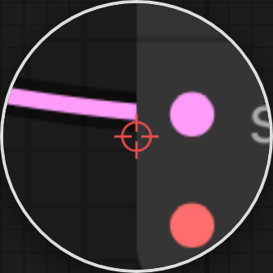

# comfyui-touch-connect

Magnifier loupe under your finger for accurate node-connection dragging on touch devices.

> Part of a family of mobile-first ComfyUI usability packs built on
> [comfy-modal-kit](https://github.com/laurigates/comfy-modal-kit)
> ([gallery-loader](https://github.com/laurigates/comfyui-gallery-loader),
> [model-gallery](https://github.com/laurigates/comfyui-model-gallery),
> [prompt-editor](https://github.com/laurigates/comfyui-prompt-editor),
> [sampler-info](https://github.com/laurigates/comfyui-sampler-info),
> [touch-numeric](https://github.com/laurigates/comfyui-touch-numeric),
> [touch-resize](https://github.com/laurigates/comfyui-touch-resize),
> [touch-tooltips](https://github.com/laurigates/comfyui-touch-tooltips)):
> additive, non-clobbering touch aids for the ComfyUI graph editor. Unlike the
> widget→modal packs in the family, this one is a **canvas-level gesture** pack —
> no widgets, no modal.



*The magnifier loupe follows your fingertip during a connection drag, so the
slot you're aiming at stays visible instead of hiding under your finger. The
crosshair marks the exact pointer point.*

## Install

```sh
cd <ComfyUI>/custom_nodes
git clone https://github.com/laurigates/comfyui-touch-connect
```

Restart ComfyUI; hard-refresh the browser tab (Ctrl+Shift+R / Cmd+Shift+R).

## What it does

Dragging a link between two node slots is painful on touch: the slots are tiny
dots and your fingertip sits directly on top of the one you're aiming at. This
pack is a **canvas-level gesture layer** — no widgets, no modal — that adds two
touch aids to connection dragging:

- **Magnifier loupe.** While a connection drag is in progress, a magnified loupe
  offset from your finger shows the region of the canvas under your fingertip
  (with a crosshair at the exact pointer point), so the slot you're targeting
  stays visible instead of hiding under your finger. It listens to `pointer*`
  events on `window` (capture phase, passive) and copies the live canvas region
  each frame with `drawImage` (canvas→canvas, no `getImageData`/taint). Purely
  visual: `pointer-events:none` overlay, never consumes or alters the pointer
  events driving the actual drag.
- **Port snapping (issue #23, on by default).** A purely-visual loupe can't fix
  the *start* of a drag — LiteGraph commits the source slot on `pointerdown`. So
  `CONFIG.snap` corrects a touch that lands *near but not on* a slot by
  re-dispatching the `pointerdown` at the slot centre (same `pointerId`, so the
  live finger's move/up still route to the canvas). Only `pointerdown` is
  corrected; move/up pass through untouched. Fail-safe and reversible — set
  `CONFIG.snap = false` to restore the purely-observational behaviour.

Touch only: it activates solely for `pointerType: "touch"`; mouse/trackpad input
is left completely untouched.

## Compatibility

- ComfyUI: modern Vue frontend (`comfyui-frontend-package >= 1.40`) for the
  `LGraphCanvas` connection-drag APIs this pack reads — the `connecting_links`
  drag-state signal (polled via `isConnecting()`) and `DragAndScale`
  (`ds.offset`/`ds.scale`) graph→client projection. It does **not** patch
  LiteGraph methods or hook `widget.onPointerDown`; it observes via window
  capture-phase pointer listeners and a `pointer-events:none` overlay.
- Frontend changes (JS/CSS) take effect on browser hard-refresh — no restart.

## License

MIT — see `LICENSE`.
